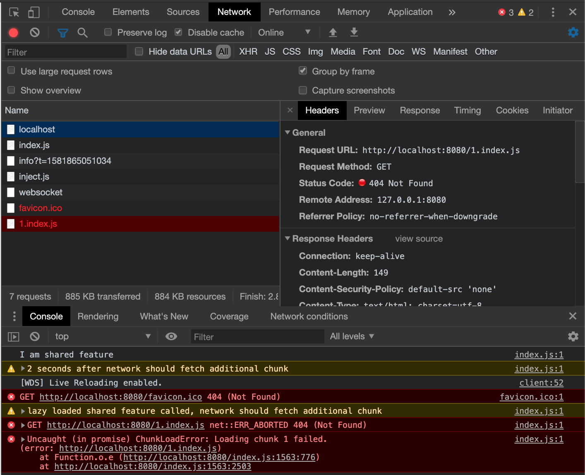

# How to run project:

### Consumer:
```
$ cd ./consumer
$ npm i 
$ npm run start
// Open developer console on running consumer page
```


### Shared lib:
Build:
```
$ npm run build
```

Pack: 
```
$ npm run pack
```

#### Installing new shared-lib version in consumer:

```
$ cd ./consumer
$ npm i my-external-lib@../shared-lib/shared-lib-1.X.X.tgz
```

### Current Problem:
Consumer is not aware about additional chunks of the shared library which will be lazy loaded 




### Related issues:
https://github.com/vuejs/vue-cli/issues/3161
https://stackoverflow.com/questions/54149892/webpack-cannot-resolve-node-modules-lazy-assets
https://github.com/webpack/webpack/issues/7843
https://github.com/webpack/webpack/issues/8934
